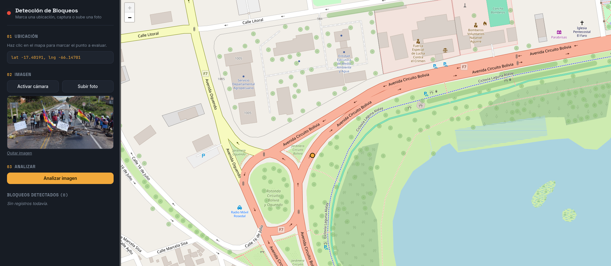
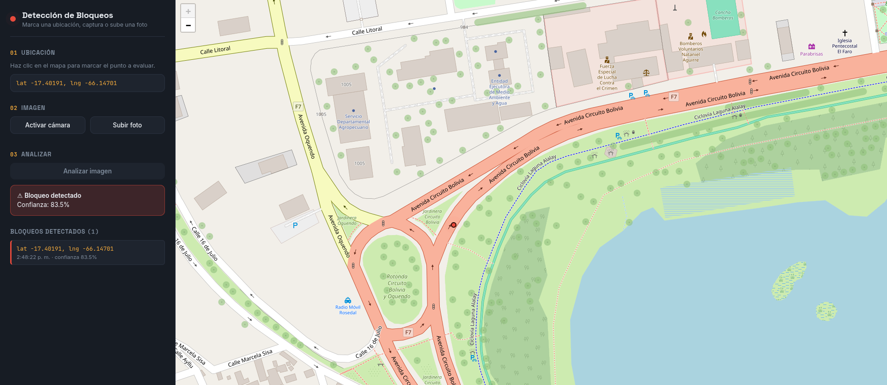
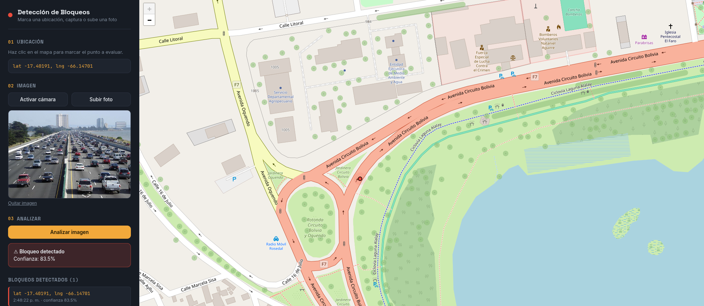
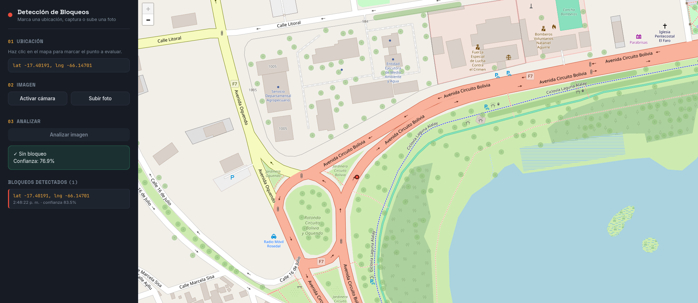
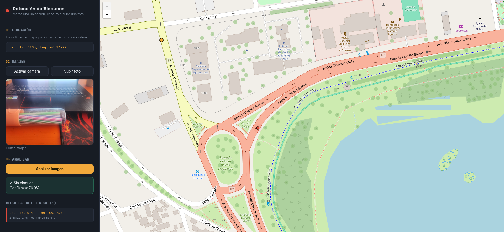
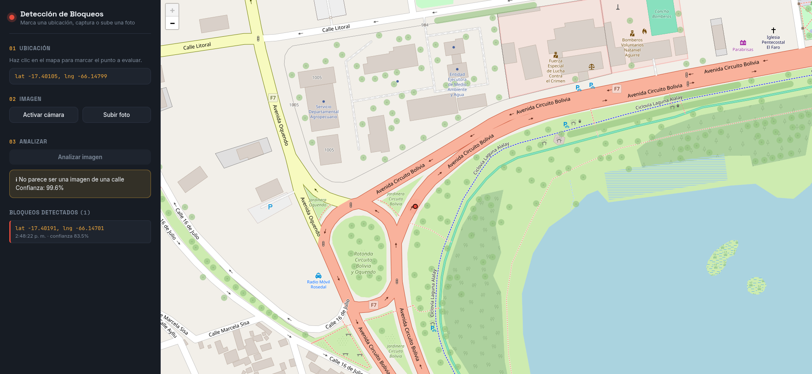

# Detección de Bloqueos en Calles

Proyecto pensado para ser instalado en semáforos y detectar calles bloqueadas en tiempo real. En Bolivia se sufre mucho de lo que son los bloqueos, a veces son anunciados pero las personas no saben exactamente los puntos de bloqueos, muchas veces son bloqueos imprevistos, como accidentes o de alguna marcha sin aviso.

Es por esto que se creo principalmente un modelo el cual determina si una calle esta bloqueada o no. Ademas de tener un modelo de apoyo para que verifique si es una una calle o es otro tipo de objetos antes de llamar al modelo principal.
## Deployado
Link del deployado
https://detector-de-bloqueos.onrender.com/
Cabe recalcar que el frontend se hizo todo con IA.

### Pruebas
- **Bloqueo detectado**  



- **No bloqueo**  



- **Con otro tipo de fotos**  


## Descripción de los modelos

### Modelo para clasificar entre bloqueo y no bloqueo
Se utilizaron los siguientes dataset:
#### BLOQUEOS
- **Bloqueos**: Imagenes de bloqueos recolectadas usando icrawler, al rededor de 300 imagenes de personas bloqueando, manifestantes recolectadas de internet.  
Dataset de Roboflow
- **Llantas**: Imagenes de llantas en calles como parte de posibles cosas que pueden usarse para bloquear  
- **Accidentes**: Imagenes de accidentes de autos que pueden identificarse como parte de un bloqueo  

#### NO BLOQUEOS
- **Trafico**: Imagenes de un trafico normal para destinguir cuando es un bloqueo
- **BDD100K**: Imagenes captadas para lo que es conduccion autonoma que cuenta con trafico y flujo normal
Se usan dos modelos en cascada:
### Modelo auxiliar para diferenciar entre calle y otros tipos de objetos
Esto para que el modelo principal no de errores de falsos positivos si se sube imagenes que son otras cosas que no sea una calle o bloqueos.
#### Dataset
- Se busco imagenes con la ayuda de icrawler de diferentes cosas, objetos, animales para que el modelo pueda distinguie

### Entrenamiento

Ambos modelos parten de **ResNet18** preentrenada en ImageNet, usando la técnica de **transfer learning**: se aprovechan los pesos ya entrenados para extraer características visuales generales, y solo se reentrena la última capa para adaptarla a cada tarea de clasificación específica. 

- **Modelo de verificación de calle**: clasifica la imagen en dos clases (`calle` / `otros`). Se usa como filtro previo para evitar que el modelo de bloqueos analice imágenes que no corresponden a una calle (objetos, animales, etc.), que era la causa de falsos positivos en la primera versión del proyecto.
- **Modelo de detección de bloqueos**: clasifica la imagen en dos clases (`bloqueo` / `no_bloqueo`). Solo se ejecuta si el modelo anterior determina que la imagen sí es una calle.

Detalles del entrenamiento (ambos modelos):
- Arquitectura base: `resnet18` de torchvision, con los pesos convolucionales congelados y solo la capa final (`fc`) entrenable.
- Optimizador: Adam, con `CrossEntropyLoss` como función de pérdida.
- Preprocesamiento: redimensionado a 224x224, normalización con las medias/desviaciones estándar de ImageNet, y data augmentation (flip horizontal, rotación, ajustes de color) durante el entrenamiento.
- Selección del mejor modelo según la precisión de validación (`val_acc`) en cada época.
- Entrenamiento documentado en los notebooks incluidos en el proyecto (`notebooks/`).

## Estructura de lo que es para el deployado

- Backend: FastAPI (Python), expone un endpoint `/api/predict` que recibe una imagen y devuelve el resultado de ambos modelos.
- Modelos: redes ResNet18 (transfer learning con torchvision), entrenadas y afinadas en notebooks incluidos en el proyecto, y cargadas con PyTorch en el backend.
- Frontend: HTML, CSS y JavaScript, con Leaflet para el mapa interactivo donde se selecciona el punto y se visualizan los bloqueos detectados.
- Deploy: pensado para correr como servicio web (ver `render.yml`), sirviendo tanto la API como los archivos estáticos desde la misma aplicación FastAPI.

```
Deteccion-Bloqueos/
├── main.py         # API FastAPI: carga los modelos y expone /api/predict
├── models/         # Pesos entrenados (.pth) de ambos modelos
│   ├── mejor_modelo_bloqueos.pth
│   └── modelo_detector_calle.pth
├── dataset/         # Datasets usados para entrenar (no incluido en git)
│   ├── imagenes_dataset/     # Imágenes crudas obtenidas por scraping/crawler
│   ├── dataset_bloqueos/     # Dataset final para el modelo de bloqueos
│   │   ├── train/
│   │   │   ├── bloqueo/
│   │   │   └── no_bloqueo/
│   │   ├── val/
│   │   └── test/
│   └── dataset_otros/ # Dataset final para el modelo de verificación de calle
│       ├── train/
│       │   ├── calle/
│       │   └── otros/
│       ├── val/
│       └── test/
├── notebooks/         # Entrenamiento y preprocesamiento de datos
│   ├── training_model.ipynb         # Entrenamiento del modelo de bloqueos
│   ├── train_model_otros.ipynb      # Entrenamiento del modelo de calles
│   └── data_preprocessing.ipynb    # Preprocesamiento y armado del dataset
├── scripts/
│   └── Obtencion-imagenes/         # Scripts para descargar imágenes
│       ├── descargar_imagenes.py
│       └── descarga_otros.py
├── static/                          # Frontend: estilos y lógica del mapa
│   ├── script.js
│   └── style.css
├── templates/
│   └── index.html                   # Interfaz principal
├── capturas/                        # Imágenes analizadas en la interfaz
│   ├── bloqueo/
│   ├── no_bloqueo/
│   └── no_calle/
├── requirements.txt                 # Dependencias del proyecto
├── render.yml                       # Configuración de deploy en Render
└── README.md
```

## Futuro

- Simular la instalación en semáforos procesando video en lugar de fotos individuales.
- Solicitar la ubicación actual del dispositivo para verificar que la imagen corresponde a una calle real.
- Complementar la detección con web scraping de noticias para identificar zonas o puntos de bloqueo reportados, aumentando la credibilidad del sistema.